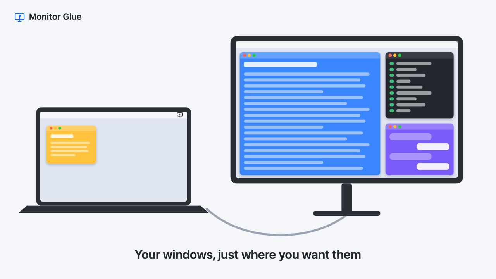
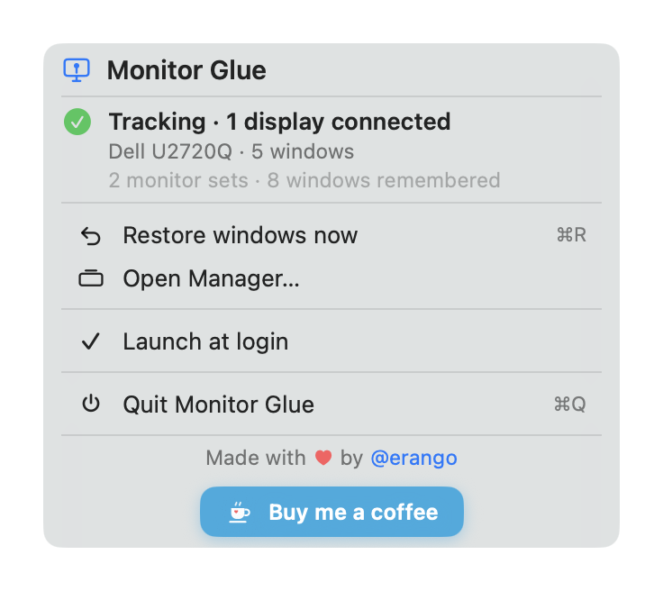
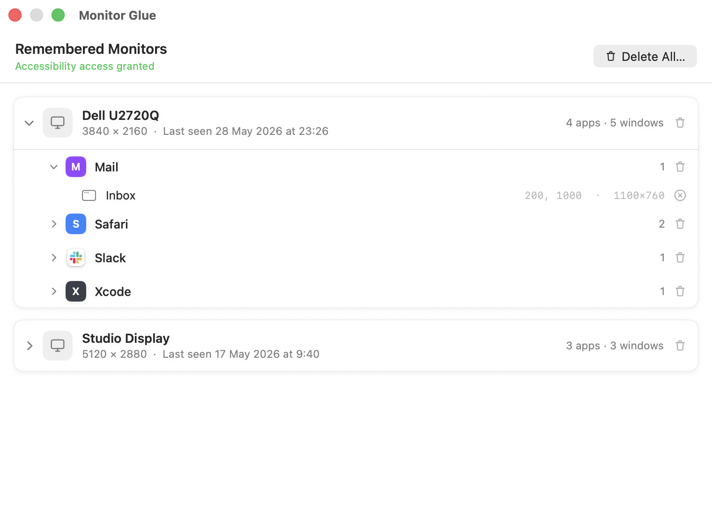

# Monitor Glue

**Your windows go back where they belong when you plug your monitor back in.**

[](https://github.com/erango/monitor-glue/releases/latest)

[](LICENSE)
[](https://ko-fi.com/erango)

<p align="center">
  
</p>

## The problem

You work from home on one monitor and from the office on another. Every time you unplug,
macOS piles every window onto the laptop screen. Plug back in, and nothing goes back — macOS
only half-remembers the *last* display you used. So you drag and resize the same windows,
every morning.

Monitor Glue remembers where each window lived, **separately for each monitor you use**, and
puts them back — right monitor, right position, right size — the moment you reconnect.

## What it does

- **Remembers per monitor.** Home and office layouts are kept apart and never overwrite each
  other.
- **Restores automatically** when a monitor connects, when you open the lid, when the Mac wakes,
  and when you unlock. If you plug in at the lock screen, it waits and places everything the
  moment you unlock.
- **Respects your changes.** Resize a window on the monitor and that becomes its new place.
  Drag a window to the laptop screen and it stays there — it won't be yanked back.
- **Copes with stubborn apps.** Some apps refuse certain sizes (Slack has a minimum width);
  Monitor Glue takes what the app allows instead of fighting it.
- **Stays out of the way.** A menu-bar app with no Dock icon. A manager window shows every
  remembered monitor, app and window, and lets you forget any of them.

<p align="center">
  
  
</p>

## Install

With [Homebrew](https://brew.sh):

```bash
brew install --cask erango/tap/monitor-glue
```

Or download `MonitorGlue.zip` from the [latest release](https://github.com/erango/monitor-glue/releases/latest),
unzip it, and drag **MonitorGlue.app** to your Applications folder.

Then open it and grant **Accessibility** access when asked (System Settings → Privacy &
Security → Accessibility). This is the only permission it needs.

Requires macOS 14 Sonoma or later. The app is signed with a Developer ID and notarized by Apple.

## Privacy

No network access, no analytics, no accounts. Accessibility is used to read and set the
position and size of other apps' windows — never their contents. Everything stays on your Mac:

| What | Where |
|---|---|
| Remembered layouts | `~/Library/Application Support/MonitorGlue/layouts.json` |
| Activity log (for troubleshooting) | `~/Library/Application Support/MonitorGlue/monitor-glue.log` |

## How it works

- **Monitors are identified by their hardware UUID**, not their macOS display ID (which changes
  on every reconnect). The set of attached external displays forms the key a layout is saved
  under — so a home monitor and an office monitor never share a layout.
- **Positions are stored relative to the monitor's own origin.** macOS often brings a display
  back at a different place in its arrangement; relative coordinates still land correctly.
- **Windows are read and moved with the Accessibility API**, matched back to saved entries by
  title, then by position in the app's window list.
- **Restores retry for up to three minutes**, quickly at first. Right after a wake, apps can be
  unresponsive to Accessibility for a while, and some apps are still relaunching.
- **Why it isn't on the Mac App Store:** App Store apps must run in the App Sandbox, and the
  sandbox hides other apps' windows from the Accessibility API. We tested it: the sandboxed
  build was told it was trusted and then saw zero windows.

## Troubleshooting

- **Nothing is restored:** check Accessibility is on for Monitor Glue. If it looks on but the
  app still asks for access, reset it and grant again:
  `tccutil reset Accessibility com.erango.monitorglue`
- **Something behaved oddly:** choose **Report a Bug…** in the menu. It opens a GitHub issue
  with your setup filled in and shows the log in Finder, ready to attach. The log records every
  monitor change and, for each restore, which window matched which saved entry and the frame it
  got — skim it first, since it includes window titles.

## Build from source

Needs Swift 5.9+ (the Xcode Command Line Tools are enough).

```bash
./Scripts/make_cert.sh    # once: a stable local signing identity (see below)
./Scripts/bundle.sh       # builds dist/MonitorGlue.app
open dist/MonitorGlue.app
```

An ad-hoc-signed build gets a new code hash every time it's rebuilt, and macOS then quietly
drops its Accessibility permission. `make_cert.sh` creates a self-signed identity so local
rebuilds keep the permission.

`CONFIG=debug ./Scripts/bundle.sh` builds into `dist/debug/` with a development harness
compiled in (`MG_PREVIEW=menu`, `manager`, `diag`, and friends — see `DebugPreview.swift`).
Release builds leave all of it out.

## Contributing

Issues and pull requests are welcome — especially reports of apps or monitor setups that don't
restore correctly. Include the log and your macOS version.

## Support

Monitor Glue is free and MIT-licensed. If it saves you a few minutes every morning,
[buy me a coffee](https://ko-fi.com/erango) ☕

Made by [@erango](https://github.com/erango).
